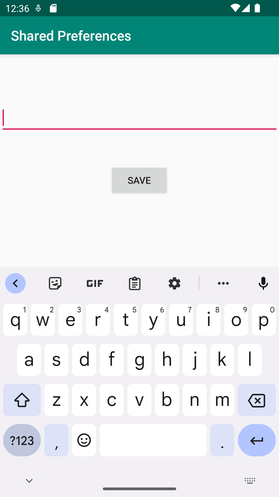

# Rapport

Skapade en till activity som fick namnet DisplayActivity sedan skapades också en layout xml fil för den som fick namnet activity_display.
La till en knapp i activity_main.xml, 2 st knappar och en EditText i activity_display.xml. Sedan skapades en "SetOnClickListener" 
och en intent för knappen i MainActivity som gör att man kommer till DisplayActivity. I DisplayActivity skapades en OnClickListener som sparar
texten man skriver i EditText på variabeln "preferences" (se koden nedan).

Knappen.setOnClickListener(new View.OnClickListener() {
    SharedPreferences.Editor editor = preferences.edit();
    editor.putString("name", name.getText().toString());
    editor.apply();
}
});

Sedan förs texten över från variabeln "preferences" till variabeln "Texten" som länkar ihop TextViewn 
som finns i activity_main.xml (se koden nedan).
När man kommer tillbaka till MainActivity visas texten som man har sparat.

protected void onResume() {
    super.onResume();
    String name = preferences.getString("name", "no name was found");
    Texten.setText(name);
}

Nedan i "Screenshot 1" kan man se hur activity_main ser ut och sedan i 
"Screenshot 2" kan man se hur activity_display ser ut.

Screenshot 1

Sceenshot 2

